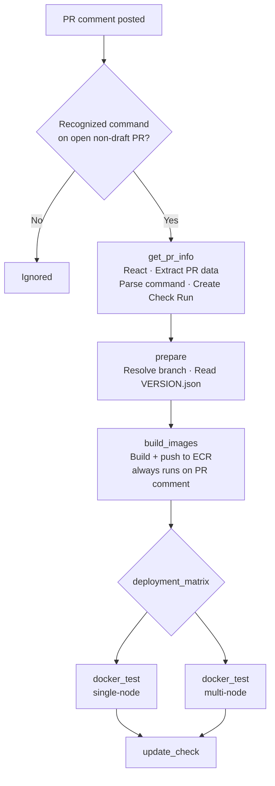
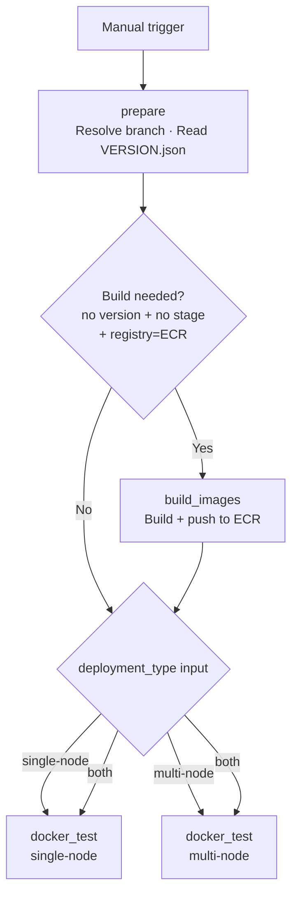

# Docker Integration Tests

Workflow file: `.github/workflows/5_check_integration_tools.yml`

This workflow optionally builds Docker images from the PR branch, provisions a dedicated AWS VM, deploys the Wazuh Docker stack (single-node or multi-node), and runs the integration test suite against it via SSH.

---

## Triggers

| Mode | Trigger | Who can trigger |
|---|---|---|
| PR comment | `issue_comment` on an open, non-draft PR | Any repo collaborator |
| Manual | `workflow_dispatch` | Anyone with repo write access |

---

## Execution Flows

### issue_comment flow



**Recognized commands:**

| Comment | Deployment matrix |
|---|---|
| `/test-docker` | `["single-node","multi-node"]` |
| `/test-docker-single` | `["single-node"]` |
| `/test-docker-multi` | `["multi-node"]` |

When triggered by PR comment, `build_images` **always** runs — images are always built from the PR branch and pushed to ECR.

### workflow_dispatch flow



`build_images` is **skipped** when either `version` or `stage` is provided, or when `registry = DockerHub`.

---

## Parameters

### workflow_dispatch inputs

| Input | Required | Default | Description |
|---|---|---|---|
| `pr_head_ref` | Yes | — | Branch of `wazuh-docker` to test |
| `automation_reference` | No | `main` | Branch of `wazuh-automation` to use |
| `deployment_type` | Yes | — | `single-node`, `multi-node`, or `both` |
| `version` | No | — | Override image version (e.g. `5.0.1`). If empty, reads from `VERSION.json` |
| `stage` | No | — | Image stage suffix (e.g. `beta1`, `beta2-latest`). Required when `version` is set |
| `registry` | No | `ECR` | `ECR` (dev/built images) or `DockerHub` (released images) |

### issue_comment parameters

All parameters are derived automatically:

| Parameter | Source |
|---|---|
| `pr_head_ref` | PR head branch from GitHub API |
| `deployment_matrix` | Parsed from comment command |
| `version` / `stage` | Read from `VERSION.json` on the PR branch |
| `registry` | Always ECR (images are always built) |
| `automation_reference` | Always `main` |

---

## Image Resolution Scenarios

The workflow distinguishes five cases based on inputs:

| Case | `version` input | `stage` input | Registry | Action | Image tag |
|---|---|---|---|---|---|
| a.1 | empty | empty | ECR (or PR comment) | **BUILD** from PR → ECR | `{version}-{stage}-latest` |
| a.2 | empty | empty | DockerHub | Pull (no build) | `{version}-{stage}` |
| b.1 | set | empty | ECR | Pull (no build) | `{version}-latest` |
| b.2 | set | empty | DockerHub | Pull (no build) | `{version}` |
| c | set or empty | set | ECR or DockerHub | Pull (no build) | `{version}-{stage}` |

> When neither `version` nor `stage` is set, `version` and `stage` are read from `VERSION.json` on the target branch.

> Case a.1 always applies when triggered by PR comment, regardless of the `registry` input (which is not available in that trigger mode).

---

## Job Details

### Job 1 — `get_pr_info` (issue_comment only)

| Step | What it does |
|---|---|
| React to comment | Adds a 🚀 reaction to the triggering PR comment |
| Extract PR data | Calls GitHub API to get PR `head_ref` and `head_sha` |
| Parse command | Maps comment text → `deployment_matrix` JSON and `check_name` string |
| Create Check Run | Creates a GitHub Check Run in `in_progress` state on the PR head SHA |

### Job 2 — `prepare` (both triggers)

| Step | What it does |
|---|---|
| Resolve context | Reads inputs (workflow_dispatch) or `get_pr_info` outputs (issue_comment) |
| Checkout `VERSION.json` | Sparse-checks out only `VERSION.json` from the target branch |
| Read version info | Extracts `version` and `stage` from `VERSION.json` |
| Show test plan | Logs the resolved image case (a.1/a.2/b.1/b.2/c) and writes a summary table |

Outputs: `pr_head_ref`, `deployment_matrix`, `wazuh_version`, `wazuh_stage`.

### Job 3 — `build_images` (conditional)

Calls the reusable workflow `.github/workflows/5_build_and_push_images.yml`.

**Runs when:** `version == ''` AND `stage == ''` AND (`registry == 'ECR'` OR `github.event_name == 'issue_comment'`).

**Skipped when:** any explicit `version` or `stage` is provided, or `registry = DockerHub`.

| Parameter passed | Value |
|---|---|
| `image_tag` | `{wazuh_version}-{wazuh_stage}` |
| `docker_reference` | `pr_head_ref` |
| `wazuh_automation_reference` | `automation_reference` input |
| `products` | `wazuh-manager,wazuh-dashboard,wazuh-indexer,wazuh-agent` |
| `dev` | `true` |
| `id` | `docker-integration-{run_id}` |

### Job 4 — `docker_test` (matrix, both triggers)

Runs once per entry in `deployment_matrix`. Each instance provisions its own VM.

#### Setup

1. Checkout `wazuh-automation` at `automation_reference`
2. Checkout `wazuh-docker` at `pr_head_ref`
3. Resolve image configuration (see [Image Resolution Scenarios](#image-resolution-scenarios)) → sets `DOCKER_REGISTRY`, `DOCKER_TAG`, `DOCKER_VERSION`
4. Set up Python 3.12 and install `test_runner`
5. Configure AWS credentials via OIDC (`AWS_IAM_DOCKER_ROLE`)

#### Instance allocation

Provisions a dedicated AWS VM using the `deployability` allocator module:

```bash
python3 wazuh-automation/deployability/modules/allocation/main.py \
  --action create \
  --provider aws \
  --size large \
  --composite-name ubuntu-24-amd64 \
  --instance-name gha_{run_id}_docker_{deployment_type} \
  --label-team devops \
  --label-termination-date 1d
```

The allocator writes `inventory.yml` with the SSH connection details (`ansible_host`, `ansible_port`, `ansible_user`, `ansible_ssh_private_key_file`). These are extracted and exported as `SSH_HOST`, `SSH_PORT`, `SSH_USER`, `SSH_KEY` environment variables.

#### VM configuration and Docker install

All subsequent steps run on the remote VM over SSH:

1. **Install Docker CE**: `curl -fsSL https://get.docker.com | sudo sh`
2. **Login to ECR** (when registry is ECR or trigger is issue_comment): authenticates the VM's Docker daemon to the dev registry
3. **Set `vm.max_map_count=262144`**: required for OpenSearch/Wazuh Indexer

#### Certificate generation and config

Runs on the **runner** (not the VM):

1. **Download `wazuh-certs-tool.sh`** directly from the packages URL:
   - Pre-release: `packages-staging.xdrsiem.wazuh.info/pre-release/{major}.x/installation-assistant/wazuh-certs-tool-{version}-{stage}.sh`
   - Release: `packages.wazuh.com/{major}.{minor}/wazuh-certs-tool-{version}-1.sh`

2. **Generate `config.yml`** inline based on deployment type:

   **single-node:**
   ```yaml
   nodes:
     indexer:  [{ name: wazuh.indexer,   dns: wazuh.indexer }]
     manager:  [{ name: wazuh.manager,   dns: wazuh.manager }]
     dashboard:[{ name: wazuh.dashboard, dns: wazuh.dashboard }]
   ```

   **multi-node:**
   ```yaml
   nodes:
     indexer:
       - { name: wazuh1.indexer, dns: wazuh1.indexer }
       - { name: wazuh2.indexer, dns: wazuh2.indexer }
       - { name: wazuh3.indexer, dns: wazuh3.indexer }
     manager:
       - { name: wazuh.master, dns: wazuh.master, node_type: master }
       - { name: wazuh.worker, dns: wazuh.worker, node_type: worker }
     dashboard: [{ name: wazuh.dashboard, dns: wazuh.dashboard }]
   ```

3. **Copy `wazuh-docker/` to VM** via SCP: `scp -r wazuh-docker {remote}:/tmp/wazuh-docker`

4. **Generate certificates on VM**: runs `tools/utils/deployment/certificates-conf.sh --cert --copy` inside `/tmp/wazuh-docker/{deployment}/`

#### Deployment

```bash
# On the VM
cd /tmp/wazuh-docker/{deployment_type}
sudo docker compose up -d
```

Waits up to **15 minutes** polling every 10 seconds until all non-nginx containers report `healthy` status.

After containers are healthy, waits for steady state:
- `single-node`: 60 seconds
- `multi-node`: 90 seconds

#### Test execution

```bash
test_runner \
  --test-type "docker-{deployment_type}" \
  --deployment-type "docker-{deployment_type}" \
  --ssh-host "{SSH_HOST}" \
  --ssh-port "{SSH_PORT}" \
  --ssh-key-path "{SSH_KEY}" \
  --ssh-username "{SSH_USER}" \
  --version "{DOCKER_VERSION}" \
  --log-level INFO \
  --output github \
  --output-file "test-results-docker-{deployment_type}.github"
```

| Argument | Value | Notes |
|---|---|---|
| `--test-type` | `docker-single-node` or `docker-multi-node` | Selects the test module set |
| `--deployment-type` | `docker-single-node` or `docker-multi-node` | Selects the deployment profile |
| `--ssh-host/port/key/username` | From allocator inventory | Connects to the allocated VM |
| `--version` | Resolved `DOCKER_VERSION` | Used for version assertion tests |
| `--output github` | — | Emits GitHub Actions annotations |

For details on what `docker-single-node` and `docker-multi-node` test types validate, see the [Integration Test Module — Description](https://documentation.xdrsiem.wazuh.info/repos/wazuh-automation/main/ref/integration_test_module/description.html).

#### Reporting

| Output | When | Content |
|---|---|---|
| Step summary | Always | Test results appended to `$GITHUB_STEP_SUMMARY` |
| PR comment | `issue_comment` trigger only | Posts or updates a comment (marker: `<!-- docker-integration-check-{deployment} -->`) with ✅/❌ and results |
| Artifact: `test-results-docker-{deployment}-{run_id}` | Always | Results file, retained 7 days |
| Artifact: `docker-logs-{deployment}-{run_id}` | On failure only | Full `docker compose logs` output, retained 7 days |

#### Cleanup (always runs, even on failure)

1. `docker compose down -v` on the VM (stops containers and removes volumes)
2. Deallocate the VM:
   ```bash
   python3 wazuh-automation/deployability/modules/allocation/main.py \
     --action delete \
     --track-output {ALLOCATOR_PATH}/track.yml
   ```

### Job 5 — `update_check` (issue_comment only)

Updates the GitHub Check Run created in Job 1:

| `docker_test` result | Check conclusion |
|---|---|
| `success` | `success` — ✅ All Docker integration tests passed |
| `failure` | `failure` — ❌ One or more tests failed |
| `cancelled` | `cancelled` |

---

## Required Secrets and Variables

### Secrets

| Secret | Used by |
|---|---|
| `AWS_IAM_DOCKER_ROLE` | OIDC role for AWS operations (allocator + ECR) |
| `GH_CLONE_TOKEN` | Checkout `wazuh-automation` |
| `GITHUB_TOKEN` | PR comments and Check Run updates (built-in) |

### Repository variables

| Variable | Used by |
|---|---|
| `IMAGE_REGISTRY_PROD` | DockerHub registry URL |
| `IMAGE_REGISTRY_DEV` | ECR registry URL |

---

## Permissions

| Permission | Purpose |
|---|---|
| `id-token: write` | OIDC authentication to AWS |
| `contents: read` | Checkout repository |
| `pull-requests: write` | Post PR comments |
| `issues: write` | Post comments via issues API |
| `checks: write` | Create and update GitHub Check Runs |

---

## Instance Naming

Allocated VMs are named:

```
gha_{github.run_id}_docker_{deployment_type}
```

Example: `gha_12345678_docker_single-node`

VMs are tagged with `termination-date: 1d` — they are automatically terminated after 24 hours as a safety net, even if the cleanup step fails.
